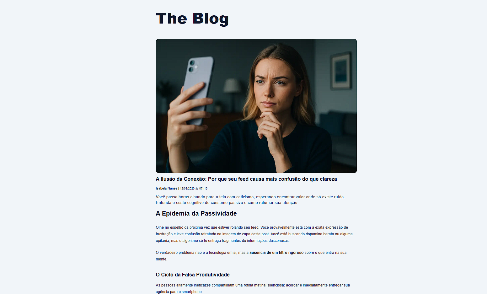
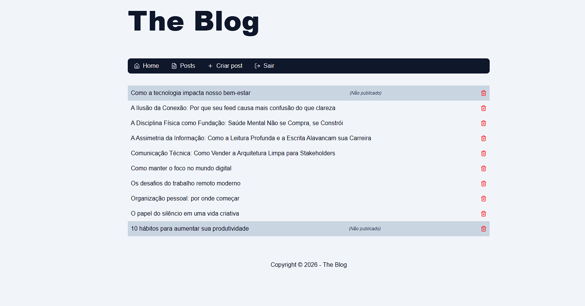
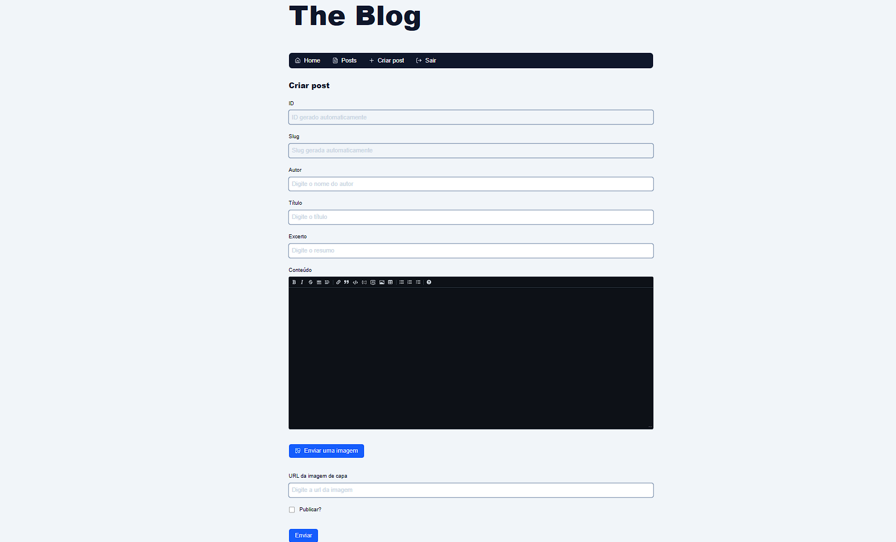
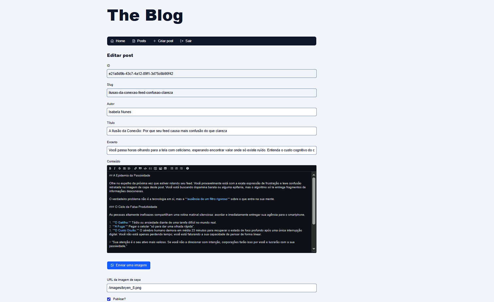

# High-Performance Next.js CMS ⚡


## 📌 Visão Geral

Um Content Management System (CMS) construído do zero com foco extremo em SEO e Core Web Vitals. A aplicação utiliza renderização híbrida (Server-Side Rendering e Static Site Generation) para entregar conteúdo com latência mínima, garantindo indexação otimizada para motores de busca.

Conta com um painel administrativo seguro, protegido na camada de borda (Edge Middleware), e um modelo de dados estritamente tipado.

## 🧠 Engenharia e Decisões Arquiteturais

O projeto abandona abstrações pesadas em favor de controle granular sobre o banco de dados e a renderização do React.

### 1. Padrão Repository e Tipagem Estrita (Drizzle ORM)

A camada de persistência foi isolada utilizando o padrão Repository (`PostRepository`). A implementação concreta (`DrizzlePostRepository`) utiliza **Drizzle ORM** para garantir tipagem estrita de ponta a ponta, desde a query SQL até a renderização do componente. Isso elimina erros de runtime por incompatibilidade de schema e facilita a manutenção ou futura troca do banco de dados.

### 2. Streaming e Carregamento Progressivo

Para evitar o bloqueio da renderização inicial, a interface implementa `React.Suspense` no nível dos layouts (`HomePage`, `PostSlugPage`). Isso permite o envio imediato da casca HTML (skeleton/spinners) enquanto as queries de banco de dados (`findAllPublic`, `findBySlugPublic`) são resolvidas no servidor de forma assíncrona.

### 3. SEO Dinâmico e Cache

As páginas de leitura de artigos geram tags meta (`generateMetadata`) dinamicamente no servidor antes de servirem o HTML. Além disso, as consultas públicas passam por uma camada de cache (`findPublicPostBySlugCached`) para reduzir o load no banco de dados durante picos de tráfego.

### 4. Segurança no Painel Administrativo

O acesso ao painel de administração e às rotas de mutação (Create, Update, Delete) é blindado. A verificação de sessão e variáveis de ambiente vitais (`ALLOW_LOGIN`) ocorre no servidor, garantindo que o client-side não vaze interfaces restritas.

## 💻 Telas da Aplicação

**Visão Pública do Blog**
<br>

<table align="center">
  <tr>
    <td align="center"><strong>Home do Blog (Listagem)</strong></td>
    <td align="center"><strong>Leitura do Artigo (Post)</strong></td>
  </tr>
  <tr>
    <td></td>
    <td></td>
  </tr>
</table>

<details>
<summary><b>📷 Explorar o Painel Administrativo (CMS)</b></summary>
<br>

O painel administrativo permite o controle total do ciclo de vida das postagens, refletindo diretamente as operações do `DrizzlePostRepository`.

|                                Dashboard de Posts                                |                                Criação de Conteúdo                                 |                                Edição de Conteúdo                                 |
| :------------------------------------------------------------------------------: | :--------------------------------------------------------------------------------: | :-------------------------------------------------------------------------------: |
|  |  |  |

</details>

## 🚀 Como Executar o Ambiente Local

**Pré-requisitos:** Node.js 18+, gerenciador de pacotes (NPM/Yarn/PNPM) e um banco de dados relacional (PostgreSQL/MySQL) rodando.

```bash
# 1. Clone o repositório
git clone [https://github.com/RuanC4rlos/blog-next-react.git](https://github.com/RuanC4rlos/blog-next-react.git)

# 2. Acesse a pasta
cd blog

# 3. Instale as dependências
npm install

# 4. Configure as Variáveis de Ambiente
# Crie um arquivo .env na raiz do projeto baseado no .env.example
# Banco de Dados
DATABASE_URL="sua_string_de_conexao"

# Configuração de Uploads Locais
NEXT_PUBLIC_IMAGE_UPLOAD_MAX_SIZE=921600
IMAGE_UPLOAD_DIRECTORY=uploads
IMAGE_SERVER_URL='http://localhost:3000/uploads'

# Segurança e JWT
# Gere a chave usando: npx tsx src/utils/generate-hashed-password.ts
JWT_SECRET_KEY='SUA_SECRET_KEY_AQUI'
LOGIN_COOKIE_NAME='loginSession'
LOGIN_EXPIRATION_SECONDS=86400
LOGIN_EXPIRATION_STRING='1d'

# Credenciais de Acesso ao Painel Admin
ALLOW_LOGIN=1
LOGIN_USER='admin'
LOGIN_PASS='hash_da_senha_gerada_no_utilitario'

# 5. Execute as migrações do Drizzle
npm run db:push  # Ou o script equivalente que você configurou para migração

# 6. Inicie o servidor de desenvolvimento
npm run dev
```
